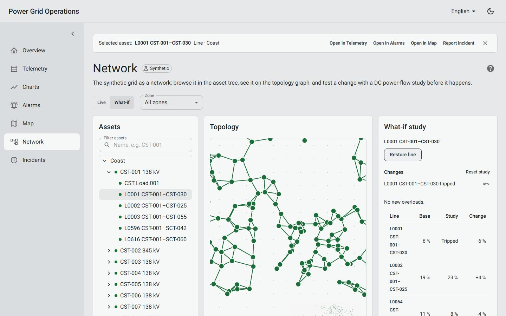
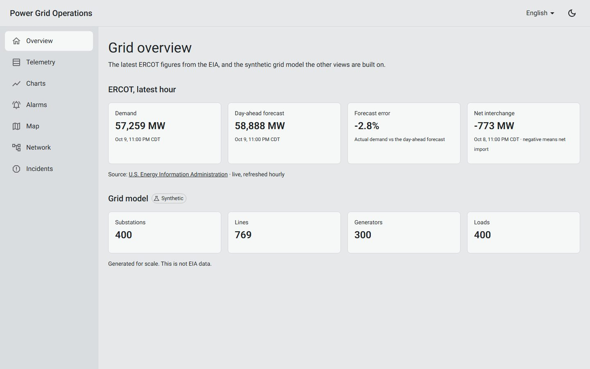
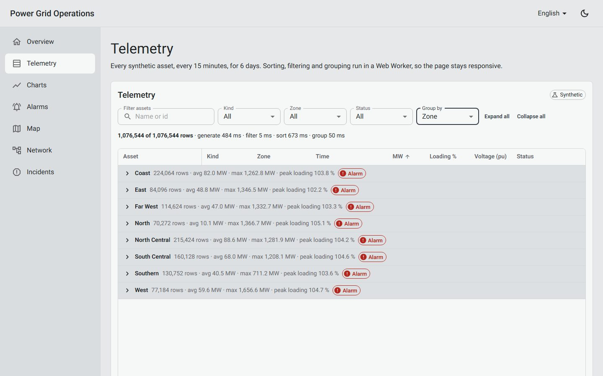
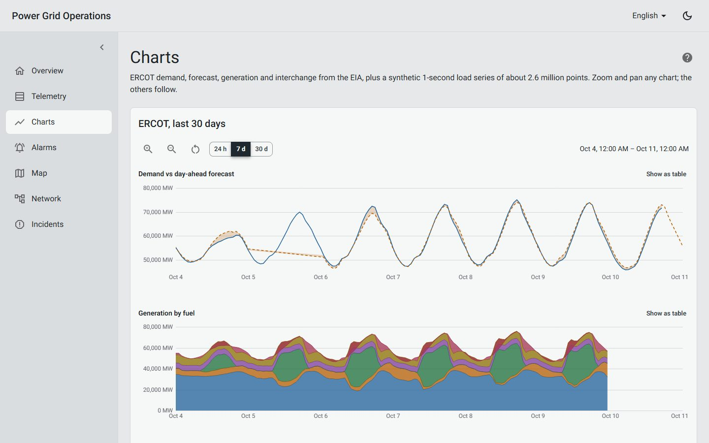
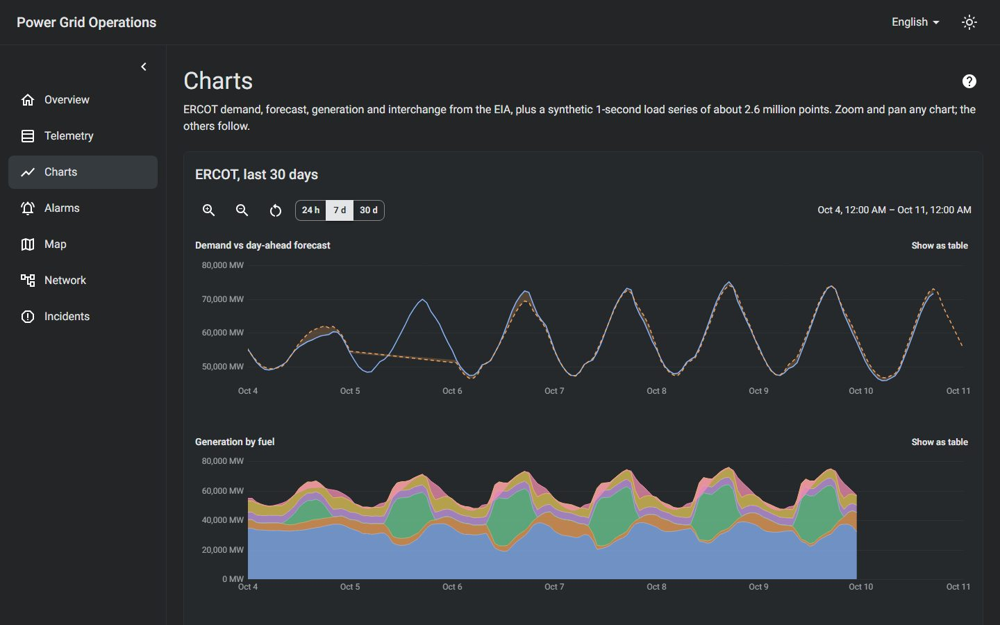
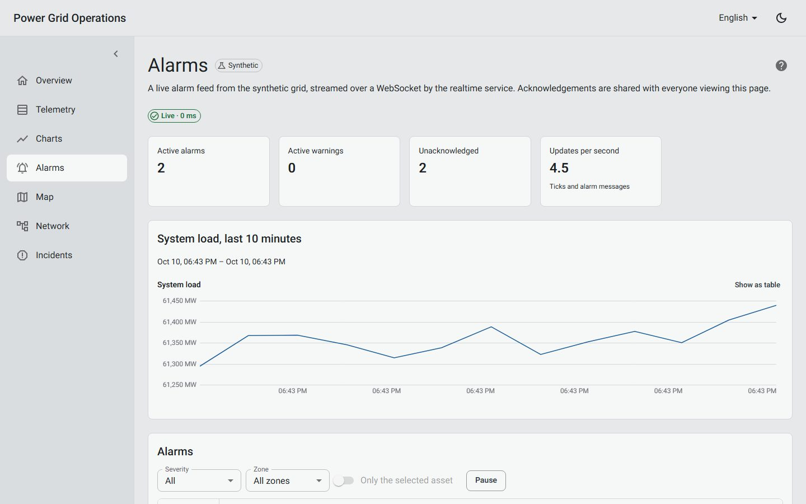
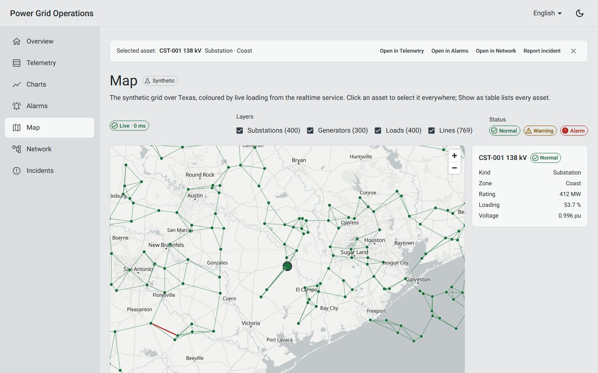
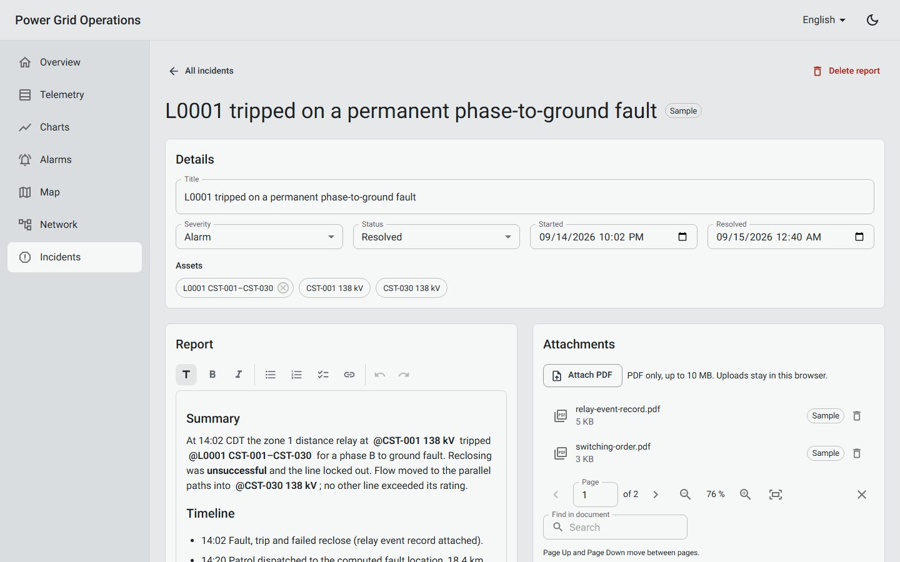

# Power Grid Operations

An operations console for the Texas (ERCOT) power grid. It shows how a data-heavy, real-time
frontend for the energy industry can be built: large data grids, advanced charts, graph views,
maps, a document viewer with rich text, live updates, Rust/WASM number crunching, and an
accessible, tested component library.

**Live demo:** _link added after the first release (see [M11](docs/m11-finish.md#release-checklist))._



## Demo

An 80-second tour of every module, recorded with `yarn demo:record`:
_video link added after upload._

<details>
<summary><b>Screenshots</b></summary>

|                                            |                                                          |
| ------------------------------------------ | -------------------------------------------------------- |
|  |              |
|      |  |
|      |                          |
|    |        |

</details>

## Product scope

One app, a grid operations console:

| Module            | What it does                                                                |
| ----------------- | --------------------------------------------------------------------------- |
| Telemetry table   | 1M+ rows with virtual scrolling, sort, filter and grouping                  |
| Chart workbench   | Forecast vs actual, with zoom, brush and synced crosshairs                  |
| WASM downsampling | Rust compiled to WASM, run in a Web Worker, with a JS vs WASM timing toggle |
| Alarm feed        | Live stream that updates the map, table and charts                          |
| Live map          | Assets coloured by load, updated in real time                               |
| Network view      | Asset tree, topology canvas and a "what if" node editor                     |
| Incident reports  | Rich-text reports that link to assets, with a PDF viewer for attachments    |

Across every module:

- **Linked selection:** click an asset anywhere and every view follows.
- **Shared component library:** accessible and tested.
- **Installable and offline-ready (PWA):** pages you have opened, and your incident reports,
  work without a connection. See [M12: Progressive Web App](docs/m12-pwa.md).

## Getting started

Requires Node 22+ and Yarn 1.

```bash
yarn install
cp apps/web/.env.example apps/web/.env.local   # optional: add your EIA API key
yarn dev                                        # web on :3000, realtime service on :8081
```

Without a key, the app runs on the committed EIA snapshot. Rust is only needed to change the
WebAssembly code: the built module is committed (see
[M5: Rust/WASM downsampling](docs/m5-wasm-downsampling.md)).

<details>
<summary><b>Tech stack</b></summary>

| Concern        | Choice                                                                                  |
| -------------- | --------------------------------------------------------------------------------------- |
| Framework      | Next.js (App Router, server and client components), React, TypeScript (strict)          |
| UI             | Material UI with a CSS-variable theme (light and dark)                                  |
| Design system  | `@pgo/ui` on Material UI, documented in Storybook                                       |
| State and data | Redux Toolkit + RTK Query                                                               |
| i18n           | i18next, in English, Spanish, French, Italian and Romanian                              |
| Compute        | Rust compiled to WebAssembly (`wasm-bindgen`, `wasm-pack`), run in Web Workers          |
| Map            | MapLibre GL with OpenFreeMap tiles (no API key)                                         |
| Graphs         | React Flow (topology), MUI X Tree View                                                  |
| Documents      | Tiptap (rich text), pdf.js (PDF viewer), IndexedDB via `idb`                            |
| Tests          | Vitest + Testing Library + axe-core, Playwright + axe (pages and every Storybook story) |
| Hosting        | Google Cloud Run: the web app and a WebSocket service (`ws`, Node 22)                   |
| Tooling        | Yarn workspaces, ESLint, Prettier, GitHub Actions                                       |

All other UI libraries are open source and need no API keys. Map tiles by
[OpenFreeMap](https://openfreemap.org), © OpenMapTiles, data ©
[OpenStreetMap](https://www.openstreetmap.org/copyright) contributors.

</details>

<details>
<summary><b>Data sources (EIA + synthetic)</b></summary>

**Source:** the [U.S. Energy Information Administration (EIA)](https://www.eia.gov/opendata/)
API, for the ERCOT balancing authority. It provides hourly demand, demand forecast, generation
by fuel, and interchange.

**Synthetic data:** generated data is added on top for scale, e.g. grid assets and
high-frequency telemetry. It is always labelled **synthetic** and is never presented as EIA
data.

**EIA terms:**

- Source credited as "U.S. Energy Information Administration".
- No EIA logo.
- No implied endorsement by EIA.

**How the app gets EIA data:**

- **With `EIA_API_KEY`:** the server fetches the last 30 days live and caches them for an hour.
- **Without the key, or if EIA is down:** it serves a committed snapshot,
  `packages/grid-model/data/ercot-snapshot.json`, refreshed with `yarn data:fetch`.
- **After an EIA failure or timeout (8 s):** the snapshot is served for 10 minutes before EIA
  is tried again, so an outage never slows pages down. It is logged as one warning.
- The page always shows which of the two it is using ("live" or "snapshot of &lt;date&gt;").
- The key is only read on the server and never reaches the browser.

**Synthetic grid model** (`packages/grid-model`):

- **Generated from a fixed seed,** so every build produces the same data:
  - 400 substations
  - 400 loads
  - 300 generators
  - 769 lines in one connected network across ERCOT's 8 weather zones
- **Telemetry:** 1.08M rows (every asset every 15 minutes for 6 days), stored as columnar
  typed arrays and generated in about 0.2 s.
- **Load shape:** follows the real EIA demand curve.

| Endpoint             | Returns                                                                  |
| -------------------- | ------------------------------------------------------------------------ |
| `GET /api/eia/ercot` | EIA series: demand, day-ahead forecast, generation, interchange, by fuel |
| `GET /api/assets`    | synthetic assets, labelled `synthetic: true`                             |

</details>

<details>
<summary><b>Repository layout</b></summary>

```
apps/web/          Next.js app
  src/app/         routes (layouts, pages, route handlers)
  src/hoc/         app shell: Providers (Redux, theme, i18n) and Layout
  src/features/    self-contained feature modules
    telemetry/     /telemetry: 1M+ row grid; query engine and Web Worker
    charts/        /charts: chart workbench over EIA data and a 2.6M-point series;
                   downsampling worker (JS or WASM) and benchmark
    alarms/        /alarms: live alarm feed over a WebSocket (RTK Query streaming)
    map/           /map: MapLibre map of the grid, coloured by live loading
    network/       /network: asset tree, React Flow topology, what-if DC power-flow study
    incidents/     /incidents: Tiptap reports with asset mentions, pdf.js viewer, IndexedDB
  src/i18n/        i18next setup, server and client
  src/store/       Redux store, the base RTK Query api, the linked selection and the
                   shared live feed (store/live: WebSocket client used by alarms and map)
  src/theme/       MUI locales (the theme itself lives in packages/ui)
  src/types/       app-wide types and PATHS
  src/server/      server-only data access (EIA client with snapshot fallback, assets)
  e2e/             Playwright tests (pages, keyboard, accessibility sweep)
  measure/         yarn measure: load and interaction timings
  e2e-demo/        yarn demo:record: the scripted demo tour
  scripts/         sample-pdfs.ts: writes the synthetic PDFs in public/samples/incidents
packages/
  downsample/      min/max and LTTB downsampling in TypeScript and in Rust
    rust/          Rust crate, compiled to WebAssembly
    pkg/           wasm-pack output (committed; rebuilt with yarn wasm:build)
  grid-model/      shared types, EIA client, synthetic grid, telemetry and 1-second load
    data/          committed EIA snapshot
  ui/              design system: theme, accessible components, Storybook stories
    src/components/charts/  canvas chart workbench: panes, brush, downsampling
services/
  realtime/        WebSocket service (Cloud Run pgo-realtime): live load, asset updates, alarms
docs/              deployment guide and one plan per milestone
```

</details>

<details>
<summary><b>All commands</b></summary>

| Command                               | What it does                                                                             |
| ------------------------------------- | ---------------------------------------------------------------------------------------- |
| `yarn dev`                            | web (http://localhost:3000) and realtime service (ws://localhost:8081) with hot reload   |
| `yarn dev:web` / `yarn dev:realtime`  | one of the two                                                                           |
| `yarn build` / `yarn start`           | production build and server                                                              |
| `yarn lint` / `yarn typecheck`        | ESLint / TypeScript                                                                      |
| `yarn test`                           | unit and component tests (Vitest), in every workspace                                    |
| `yarn coverage`                       | the same with V8 coverage; fails below each workspace's thresholds (CI runs this)        |
| `yarn data:fetch`                     | downloads the last 30 days of ERCOT data from EIA into the committed snapshot            |
| `yarn wasm:build`                     | rebuilds the Rust/WASM module into `packages/downsample/pkg` (needs Rust and wasm-pack)  |
| `yarn wasm:test`                      | `cargo fmt --check`, `cargo clippy` and `cargo test` for the Rust crate                  |
| `yarn storybook`                      | local Storybook at http://localhost:6006, with hot reload                                |
| `yarn build:storybook`                | static Storybook into `apps/web/public/storybook`, served by the web app at `/storybook` |
| `yarn e2e`                            | builds, starts and runs the Playwright tests (desktop and mobile, with axe checks)       |
| `yarn measure`                        | builds, starts and measures every page and key interactions (README performance tables)  |
| `yarn demo:record`                    | records the demo tour (`demo/*.webm`) and the README screenshots (`docs/screenshots`)    |
| `yarn workspace @pgo/web samples:pdf` | rewrites the synthetic sample PDFs in `apps/web/public/samples/incidents`                |
| `yarn format`                         | Prettier                                                                                 |

Run `yarn workspace @pgo/web playwright install chromium` once before the first `yarn e2e`.

</details>

<details>
<summary><b>Design decisions</b></summary>

- **Language without flicker.** The chosen language is stored in a cookie, so the server
  renders the right language on the first request. On a first visit it falls back to the
  browser's `Accept-Language`. Server components translate with a per-request i18next instance;
  client components share one instance in the browser.
- **Light and dark without flicker.** Both color schemes are compiled into one CSS-variable
  theme, and MUI's `InitColorSchemeScript` applies the stored or system scheme before the first
  paint.
- **Responsive markup decided by CSS.** The sidebar switches between permanent (desktop) and
  temporary (mobile) with media queries rather than `useMediaQuery`, so the server-rendered
  HTML is already right for the viewport.
- **Virtual scrolling past the browser height limit.** A million 40 px rows need 43M px, more
  than browsers allow for one element. `VirtualGrid` caps the scroll area at 15M px and maps
  the scroll position proportionally onto all rows, so the last row stays reachable by
  scrollbar and by keyboard (Ctrl+End).
- **Data work off the main thread.** Telemetry is generated, filtered, sorted and grouped in a
  Web Worker. Results come back as transferable typed arrays (no copying), and the page only
  formats the visible rows.
- **Canvas charts with min/max downsampling.** Each chart draws at most about 4 points per
  pixel column (first, min, max, last), so a 2.6M-point series draws in milliseconds and no
  peak is lost. Every chart is also a `role="img"` with a text summary, keyboard-operable, and has
  a table view.
- **Rust/WASM in a worker, measured.** The 1-second series is generated and downsampled in a
  Web Worker. Rust copies it into WebAssembly memory once, so each request only passes the
  range. The Rust and TypeScript versions perform the same operations in the same order, so a
  test checks that they return identical points. A JS vs WASM toggle and a benchmark show the
  difference on the visitor's own machine.
- **Downsampling that reads less memory.** Min/max finds each pixel column's end by binary
  search, so it only scans the values, not the timestamps. At 2.6M points both engines are
  limited by memory bandwidth, and WASM is about as fast as JS. On the arithmetic-heavy
  LTTB, WASM is about 1.4× faster.
- **Real time over one WebSocket.** A second Cloud Run service runs a seeded grid simulator
  and streams load, asset updates and alarms. The page reads it through an RTK Query
  streaming endpoint (`onCacheEntryAdded`), so components use an ordinary query hook.
  - **Reconnects:** the socket reconnects with backoff (1 s up to 30 s), and every new
    connection starts with a `hello` snapshot. Cloud Run's 60-minute WebSocket limit is
    therefore invisible to the page.
  - **Shared acknowledgements:** they go to the server and are broadcast, so every tab sees
    them. One instance holds that shared state.
- **Linked selection in the store and the URL.** Selecting an asset in any table sets one
  shared value (`store/selectionSlice`), shown in a selection bar on every page and kept in the
  URL as `asset`.
  - **Parameters merged per owner:** each view writes only its own URL parameters
    (`replaceSearchParams`), so filters, chart ranges and the selection share one shareable
    link.
  - **Live follow-up:** the alarm feed asks the realtime service to `watch` the selected asset
    and gets its values every tick.
- **A live map without redrawing the map.** The grid is one GeoJSON source per asset kind,
  built once from the deterministic asset list.
  - **Feature-state updates:** live values only update the feature-state of the assets that
    changed, so about 90 updates a second don't rebuild 1,869 features.
  - **Selection:** the map shares the linked selection, so clicking an asset selects it
    everywhere.
  - **Accessible alternative:** **Show as table** lists every asset with live values for
    keyboard and screen-reader users.
- **What-if studies in the browser.** `/network` runs a DC power flow (dense LU over 400
  buses, a few ms) for every change: tripped lines, scaled loads, generators offline. It
  compares the study with the base case and lists new overloads and islands.
  - **Shareable studies:** the edits live in the URL (`study=t.ln-0012~l.sub-cst-001.20`).
  - **N-0 secure base case:** line ratings are set so the base case peaks at 80 %, because
    the synthetic grid's nameplate ratings don't come from a planned network.
- **Incident reports that stay in the browser.** The demo has no sign-in, so reports are kept
  in IndexedDB and never sent anywhere. Sample reports are seeded on first use and restored by
  **Reset demo data**.
  - **Data layer:** RTK Query endpoints call IndexedDB from `queryFn`. Autosave patches the
    cached report optimistically and refetches only the list, so the editor is never reset
    while typing. Each save is one read-modify-write transaction, so overlapping saves keep
    each other's changes.
  - **Rich text:** Tiptap with an MUI toolbar (`aria-pressed` toggles). Typing `@` suggests
    grid assets, and a mention links the asset to the report. Links are limited to http, https
    and mailto.
  - **PDFs:** pdf.js draws each page on a canvas when it scrolls near view, with its text
    layer on top for selection, search and screen readers. Uploads are checked for the
    `%PDF-` signature and a 10 MB limit. The open document and page are in the URL.
- **Accessibility checked in CI.** Every Playwright page test runs axe (WCAG 2.1 AA) in both
  color schemes. The shell has a skip link, labelled landmarks and `aria-current` navigation.
  CI also checks what axe can't:
  - every Tab stop on every page shows a visible focus ring, and focus is never trapped
  - one `h1` per page and no skipped heading levels
  - no horizontal scroll at 320 CSS px (400 % zoom)
  - reduced motion: no transitions, and no animated map or graph moves
  - forced colors: focus and status stay visible
- **Responsive under live data.** The network view keeps unchanged graph elements (React Flow
  skips them), and it renders a what-if study from a deferred value, so a click responds in
  about 100 ms even though re-drawing 1,169 graph elements takes longer.
- **Open demo.** There is no sign-in. All data is public or synthetic.

</details>

<details>
<summary><b>Performance</b></summary>

Telemetry table, `/telemetry`: 1,076,544 rows, Chromium desktop, production build.

| Operation (in a Web Worker) | Time               |
| --------------------------- | ------------------ |
| Generate all rows           | about 410 ms       |
| Filter                      | 3–15 ms            |
| Sort, 1 key / 2 keys        | about 380 / 440 ms |
| Group by zone               | about 55 ms        |

The page never blocks: all of this runs in a worker. The grid keeps about 40 rows in the DOM,
whatever the row count.

Chart workbench, `/charts`: the synthetic 1-second load series, downsampled in a Web Worker to
1,000 pixel columns. These are the page's own benchmark figures: the median of 7 runs, Chromium
desktop, production build.

| Range   | Points in range | Min/max JS | Min/max WASM | LTTB JS | LTTB WASM |
| ------- | --------------- | ---------- | ------------ | ------- | --------- |
| 24 h    | 86,402          | 1.2 ms     | 0.6 ms       | 0.7 ms  | 0.4 ms    |
| 7 days  | 604,802         | 1.7 ms     | 2.1 ms       | 2.7 ms  | 2.0 ms    |
| 30 days | 2,588,401       | 5.5 ms     | 5.8 ms       | 12.2 ms | 8.1 ms    |

- **Min/max** keeps up to 4 points per column, about 3,400 for a wide pane. **LTTB** keeps one
  point per column.
- Drawing the result takes under 1 ms on the main thread.
- In M4, downsampling and drawing ran on the main thread and took 19.7 ms for 30 days.
- The series is generated once, in the worker, so the page never blocks.

Every page and the key interactions, measured with `yarn measure` (details in
[M11](docs/m11-finish.md#measurements)). Desktop Chromium, production build, cold cache, median of 5 runs:

| Page                       | Ready    | LCP    | CLS   | TBT    | JS (compressed) |
| -------------------------- | -------- | ------ | ----- | ------ | --------------- |
| `/`                        | 307 ms   | 172 ms | 0.000 | 5 ms   | 313 kB          |
| `/telemetry`               | 1,199 ms | 180 ms | 0.007 | 7 ms   | 323 kB          |
| `/charts`                  | 1,260 ms | 220 ms | 0.000 | 7 ms   | 324 kB          |
| `/alarms`                  | 484 ms   | 160 ms | 0.036 | 7 ms   | 323 kB          |
| `/map`                     | 1,245 ms | 180 ms | 0.000 | 84 ms  | 597 kB          |
| `/network`                 | 816 ms   | 232 ms | 0.000 | 375 ms | 404 kB          |
| `/incidents`               | 557 ms   | 128 ms | 0.000 | 27 ms  | 335 kB          |
| `/incidents/inc-sample-01` | 1,239 ms | 484 ms | 0.011 | 62 ms  | 609 kB          |

- **Ready:** the page's own data is loaded and drawn. Examples: the 1M-row grid, the 2.6M-point
  series, the live feed, the first PDF page.
- **TBT:** main-thread blocking time during the load.

| Interaction                              | Median |
| ---------------------------------------- | ------ |
| Network: trip a line → button responds   | 98 ms  |
| Network: trip a line → study results     | 324 ms |
| Incidents: open a PDF → first page drawn | 540 ms |
| Telemetry: filter 1,076,544 rows by zone | 443 ms |

Lighthouse 12, desktop preset:

| Page         | Performance | Accessibility | Best practices | SEO |
| ------------ | ----------- | ------------- | -------------- | --- |
| `/`          | 100         | 100           | 100            | 100 |
| `/telemetry` | 100         | 100           | 100            | 100 |
| `/incidents` | 99          | 100           | 100            | 100 |
| `/network`   | 88          | 100           | 100            | 100 |

</details>

<details>
<summary><b>Deployment & operations</b></summary>

<details>
<summary><b>Secrets</b></summary>

| Where                   | What                                                      |
| ----------------------- | --------------------------------------------------------- |
| `apps/web/.env.local`   | local secrets such as `EIA_API_KEY` (git-ignored)         |
| `apps/web/.env.example` | committed template listing the variable names, no values  |
| Secret Manager          | production values (`eia-api-key`), mounted into Cloud Run |

The GCP identifiers under Infrastructure are not secrets. GitHub signs in to Google Cloud with
Workload Identity Federation, so no service-account key exists anywhere.

</details>

<details>
<summary><b>Branches and CI/CD</b></summary>

| Branch         | Role                                  | On push                                   |
| -------------- | ------------------------------------- | ----------------------------------------- |
| `feature/m<N>` | one per milestone, from `development` | checks run on its PR into `development`   |
| `development`  | default, integration                  | lint, typecheck, unit tests, build, e2e   |
| `main`         | release (merge `development` into it) | the same checks, then deploy to Cloud Run |

Pull requests run the checks only. The workflow is `.github/workflows/ci.yml`.

</details>

<details>
<summary><b>Cloud Run</b></summary>

**How it works:**

- Cloud Run runs containers without servers to manage.
- CI builds the app as a Docker image and deploys it as the service `pgo-web` in
  `us-central1`.
- Instances start when requests arrive and scale to zero when idle (minimum instances = 0).
- Billing covers only request time. The trade-off is a cold start: the first visit after an
  idle period can take a few seconds.

**Seeing the result of a deploy:**

| Where               | How                                                                                                                                                      |
| ------------------- | -------------------------------------------------------------------------------------------------------------------------------------------------------- |
| Live site           | Cloud Shell: `gcloud run services describe pgo-web --region=us-central1 --project=power-grid-operations --format='value(status.url)'`, then open the URL |
| Console             | https://console.cloud.google.com/run?project=power-grid-operations → `pgo-web`                                                                           |
| Revisions           | one per deploy; a new one appears after each push to `main`                                                                                              |
| Logs                | requests and server errors, e.g. "EIA request failed"                                                                                                    |
| Metrics             | requests, latency, instance count                                                                                                                        |
| Variables & Secrets | shows `EIA_API_KEY` once the secret is mounted                                                                                                           |
| Deploy history      | GitHub → Actions → runs on `main`; the "Deploy web to Cloud Run" log ends with the URL                                                                   |
| Storybook           | `<live-url>/storybook`: the published design system                                                                                                      |

</details>

<details>
<summary><b>Infrastructure</b></summary>

| Item                         | Value                                                                                       |
| ---------------------------- | ------------------------------------------------------------------------------------------- |
| GCP / Firebase project ID    | `power-grid-operations`                                                                     |
| GCP project number           | `142186164859`                                                                              |
| Cloud Run region             | `us-central1`                                                                               |
| Cloud Run service (web)      | `pgo-web`                                                                                   |
| Cloud Run service (realtime) | `pgo-realtime` (WebSocket, max 1 instance, 60 min timeout)                                  |
| Artifact Registry repository | `web` (Docker, `us-central1`)                                                               |
| Deploy service account       | `deployer@power-grid-operations.iam.gserviceaccount.com`                                    |
| Deploy account roles         | `run.admin`, `artifactregistry.writer`, `iam.serviceAccountUser`                            |
| Workload identity provider   | `projects/142186164859/locations/global/workloadIdentityPools/github/providers/github-repo` |
| Provider limited to          | `mkirashimas/power-grid-operations`                                                         |

GitHub repository **variables**, read as `vars.*` in the workflow. They are variables, not
secrets.

| Variable                         | Value                                                    |
| -------------------------------- | -------------------------------------------------------- |
| `GCP_PROJECT_ID`                 | `power-grid-operations`                                  |
| `GCP_REGION`                     | `us-central1`                                            |
| `GCP_SERVICE_ACCOUNT`            | `deployer@power-grid-operations.iam.gserviceaccount.com` |
| `GCP_WORKLOAD_IDENTITY_PROVIDER` | the provider path above                                  |
| `EIA_SECRET_NAME` (optional)     | `eia-api-key`; mounts the EIA key from Secret Manager    |

A Firestore database `(default)` (location `eur3`) exists in the project but the app does not
use it. See [docs/deploy.md](docs/deploy.md) for the deployment setup.

</details>

</details>

## Milestone docs

- [M1: Data and shared types](docs/m1-data-and-shared-types.md)
- [M2: Component library](docs/m2-component-library.md)
- [M3: Telemetry table](docs/m3-telemetry-table.md)
- [M4: Chart workbench](docs/m4-chart-workbench.md)
- [M5: Rust/WASM downsampling](docs/m5-wasm-downsampling.md)
- [M6: Real-time + alarm feed](docs/m6-realtime-alarms.md)
- [M7: Linked selection](docs/m7-linked-selection.md)
- [M8: Live map](docs/m8-live-map.md)
- [M9: Network view](docs/m9-network-view.md)
- [M10: Incident reports](docs/m10-incident-reports.md)
- [M11: Finish](docs/m11-finish.md)
- [M12: Progressive Web App](docs/m12-pwa.md)
